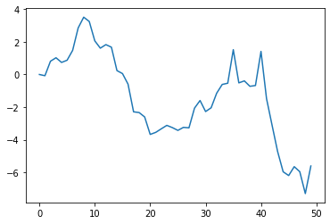

```python
print('hello world');
```

    hello world


```python
import matplotlib.pyplot as plt
import numpy as np
plt.plot(np.random.randn(50).cumsum())
```


    [<matplotlib.lines.Line2D at 0x7fd102615ee0>]


    

    


```python
a = [1,2,3]
b = a
a.append(4)
print(b)
```

    [1, 2, 3, 4]


```python
a = [1,2,3]
c = list(a)
a.append(4)
print(c)
```

    [1, 2, 3]


```python
a = 4.5
b = 2
isinstance(a, (int, float))
```


    True


```python
a = 4.5
b = 2
isinstance(a, (int, float))
print('a is {0}, b is {1}'.format(type(a), type(b)))
```

    a is <class 'float'>, b is <class 'int'>


```python
template = '{0:.2f} {1:s} are worth US${2:d}'
template.format(4.5560, 'xxx', 1)
```


    '4.56 xxx are worth US$1'


